# Final-assignment

# 1. Standard Operating Procedure: Authentically Braised Pork Belly (Hong Shao Rou)

**Document ID:**
 SOP-HSR-2026-001  
**Organization:**
 MITT NSA Group - Culinary Tech Division  
**Address:**
 130 Henlow Bay, Winnipeg, MB  
**Version:**
 V1.0  
**Effective Date:**
 April 2, 2026

---

## 2. Approval Table

| Role | Name | Date |
| :--- | :--- | :--- |
| **Prepared by** | Jie Zhuang | 2026-03-31 |
| **Prepared by** | Qianyi Wen | 2026-04-1 |
| **Prepared by** | Dongjun Li | 2026-04-1 |
| **Reviewed by** | Yuwen Nie | 2026-04-01 |
| **Approved by** | Instructor [Pending] | |

---

## 3. Purpose

The purpose of this document is to provide a standardized technical procedure for the creation of traditional Braised Pork Belly. It aims to:
* **Standardize Quality:**
 Ensure consistent "melt-in-mouth" texture and glossy amber-red appearance.
* **Define Inputs:**
 Establish a clear list of required materials (Inputs) for consistent quality.
* **Safety Compliance:**
 Ensure the final product meets food safety temperatures (Internal temp ≥ 165°F).

---

## 4. Scope and Objectives

### 4.1 Scope
This procedure applies to the MITT Final Assignment project. The scope includes:
**Inputs:** Specific measurements for 500g of premium pork belly and auxiliary spices.

**Pre-treatment:** Requirements for cutting precision and the cold-water blanching process.

**Production:** The core "SOP" from caramelization (sugar-coloring) to the 60-minute slow-braising phase.
 
**Post-Production:** Plating aesthetics and recommended flavor pairings.

### 4.2 Objectives
* Achieve a consistent "Glossy Amber-Red" visual result.
* Ensure meat tenderness (the "Chopstick Test").
* Maintain food safety standards (Internal temp ≥ 165°F).

---

## 5. Accountability Matrix

| Team Member | Functional Role | Documentation & Process Responsibilities |
| :--- | :--- | :--- |
| **Jie Zhuang** | **Project Admin** | Framework setup, Purpose, Scope, and Revision History maintenance. |
| **Dongjun Li** | **Prep Lead** | Ingredient/Tool standards and initial preparation steps. |
| **Qianyi Wen** | **Process Lead** | Core cooking steps (Caramelization/Braising) and visual media. |
| **Yuwen Nie** | **Quality Lead** | Final QC, Troubleshooting, and peer-reviewing the SOP. |

---

## 6. Process Steps

---

## 6.1 Material Selection and Ingredient Preparation (Lead: Dongjun Li)

**Scope:** This stage focuses on raw material inspection, precision cutting, and "Mise en Place" (organizing all seasonings) before any thermal processing begins.

---

### 6.1.1 Raw Material Selection and Standards

*   **Pork Belly Selection:** Select 500g of fresh pork belly with at least five distinct layers. This structure is **essential because** it provides the necessary fat for searing and ensures a melt-in-mouth texture.
*   **Inspection Tool:** A digital kitchen scale (Accuracy: ±1g) must be used to verify the mass for accurate seasoning ratios.

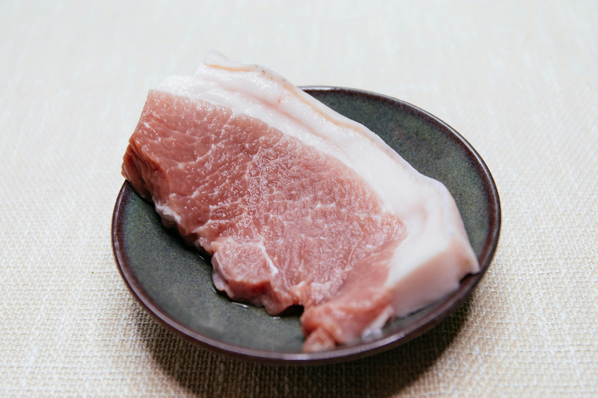
*Figure 6.1-1: Inspecting raw pork belly layers for optimal fat-to-lean distribution. (Source: [zhugewala via Pexels](https://www.pexels.com/zh-cn/photo/2676932/))*

*Figure 6.1-2: Verifying the mass using a digital scale to ensure consistent seasoning ratios. (Source: [Gustavo Fring via Pexels](https://www.pexels.com/zh-cn/photo/5622193/))*

---

### 6.1.2 Pre-treatment Procedures

**Step 1: Precision Meat Cubing**
Place the raw pork belly on a **heavy-duty bamboo cutting board** and use a **sharp chef’s knife** to cut it into uniform 2cm x 2cm cubes. This standardization is **critical because** it allows for even heat distribution, ensuring all pieces reach 165°F simultaneously.

*Figure 6.1-3: A stable bamboo cutting board used to provide a safe, non-slip surface. (Source: [Engin Akyurt via Pexels](https://www.pexels.com/zh-cn/photo/7415264/))*

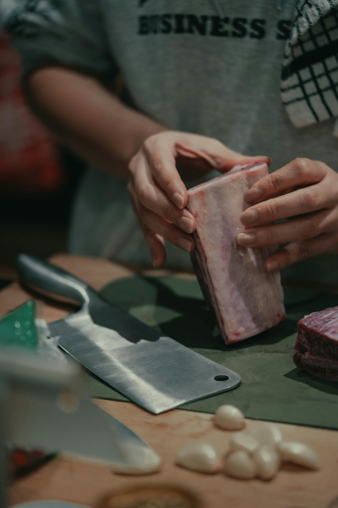
*Figure 6.1-4: A sharp chef's knife required for executing clean cuts without damaging meat fibers. (Source: [Nathan J Hilton via Pexels](https://www.pexels.com/zh-cn/photo/19199238/))*

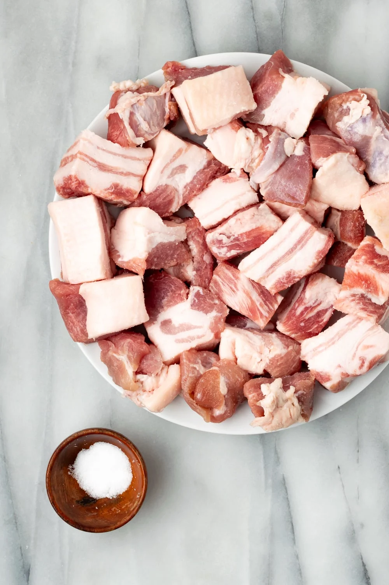
*Figure 6.1-5: Final output of Step 1: Pork belly cut into uniform 2cm cubes. (Source: [asassyspoon.com](https://asassyspoon.com/chicharrones/))*

**Step 2: Aromatic and Spice Preparation**
Wash and prepare the following aromatics: slice 50g of ginger, tie 3-4 scallions into a knot, and select 1 whole star anise and 1 cinnamon stick. Pre-cutting the ginger is **important because** it maximizes flavor release to neutralize the raw odor of the pork.

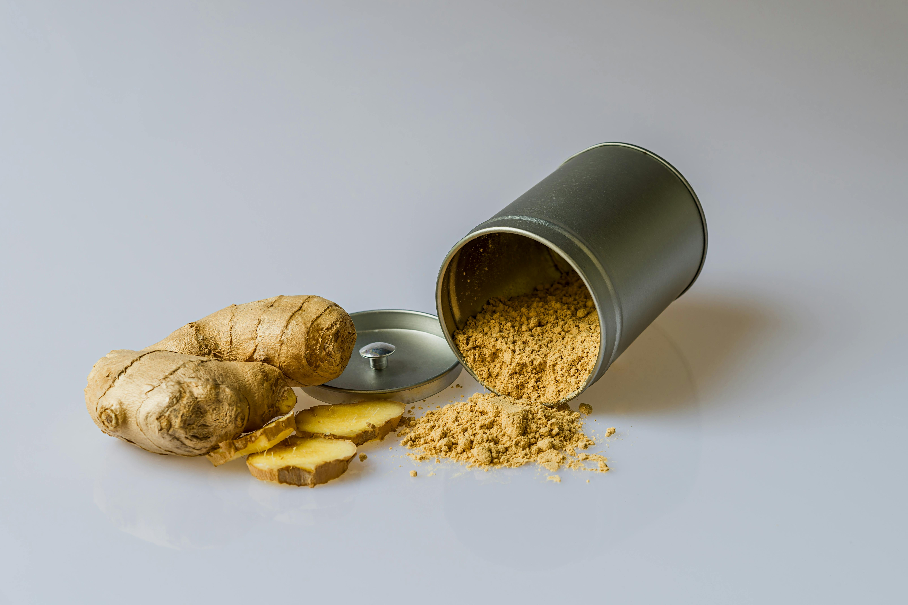
*Figure 6.1-6: Sliced ginger prepared to neutralize raw odors during braising. (Source: [Pixabay via Pexels](https://www.pexels.com/zh-cn/photo/161556/))*

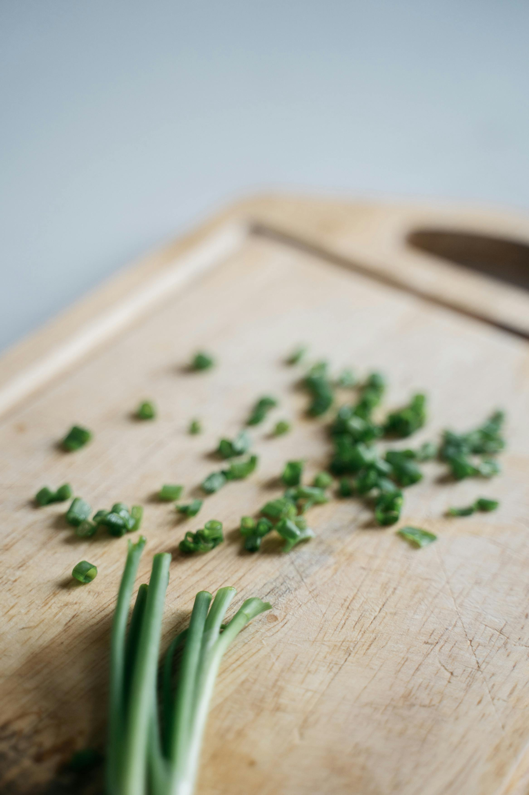
*Figure 6.1-7: Cleaning and knotting 3-4 scallions for aromatic enhancement. (Source: [Anna Tarazevich via Pexels](https://www.pexels.com/zh-cn/photo/7251865/))*

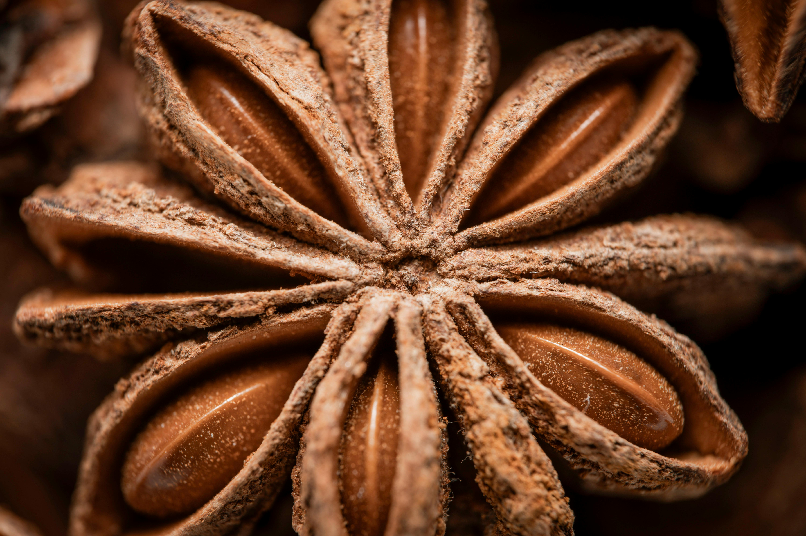
*Figure 6.1-8: Selecting whole star anise to provide the signature licorice aroma. (Source: [Raul Kozenevski via Pexels](https://www.pexels.com/zh-cn/photo/3011280/))*

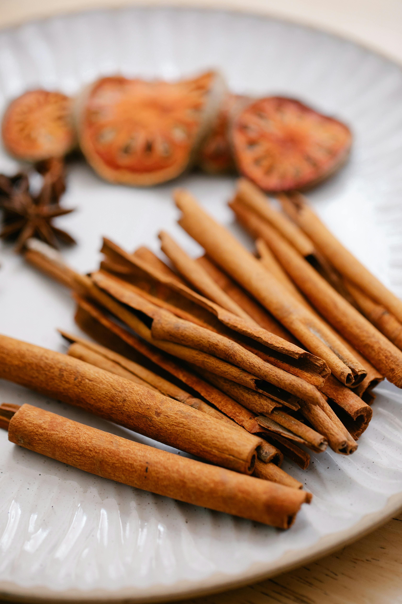
*Figure 6.1-9: Selecting a cinnamon stick to add sweet, warm undertones. (Source: [Anna Pou via Pexels](https://www.pexels.com/zh-cn/photo/8329248/))*

**Step 3: Measuring Liquid and Solid Seasonings**
Accurately measure 60g of rock sugar, 50ml of cooking wine, 50ml of soy sauce, and a portion of vegetable oil using **graduated measuring cups** and a **scale**. Preparing these materials in advance is a **critical safety step** as it prevents the Process Lead from burning the sugar while searching for ingredients.

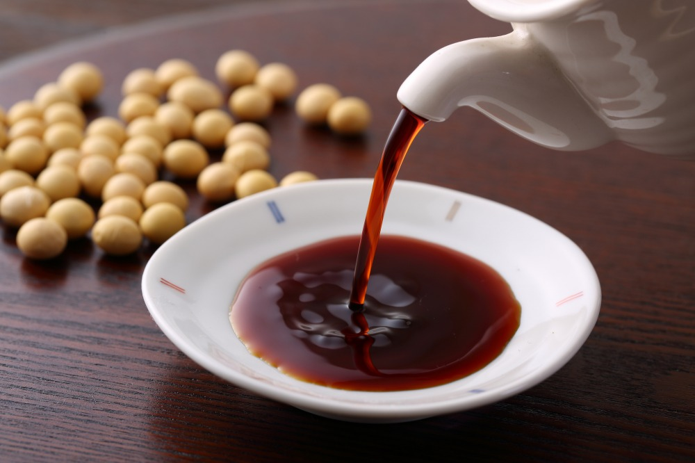
*Figure 6.1-10: Measuring soy sauce as the primary savory and color base. (Source: [THE GATE](https://thegate12.com/cn/article/172))*

*Figure 6.1-11: Using a graduated cup for precise volume control of liquid seasonings. (Source: [Steve Johnson via Pexels](https://www.pexels.com/zh-cn/photo/1005731/))*

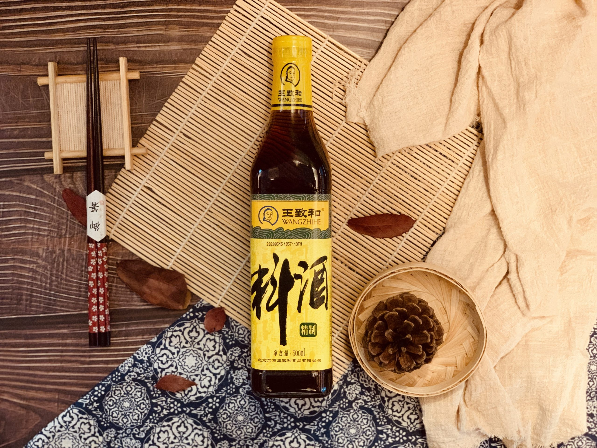
*Figure 6.1-12: Preparing 50ml of Shaoxing cooking wine to tenderize the meat and remove odors. (Source: [TSH Food](https://www.tshfoodhk.com/product/%E7%B2%BE%E5%88%B6%E6%96%99%E9%85%92/))*

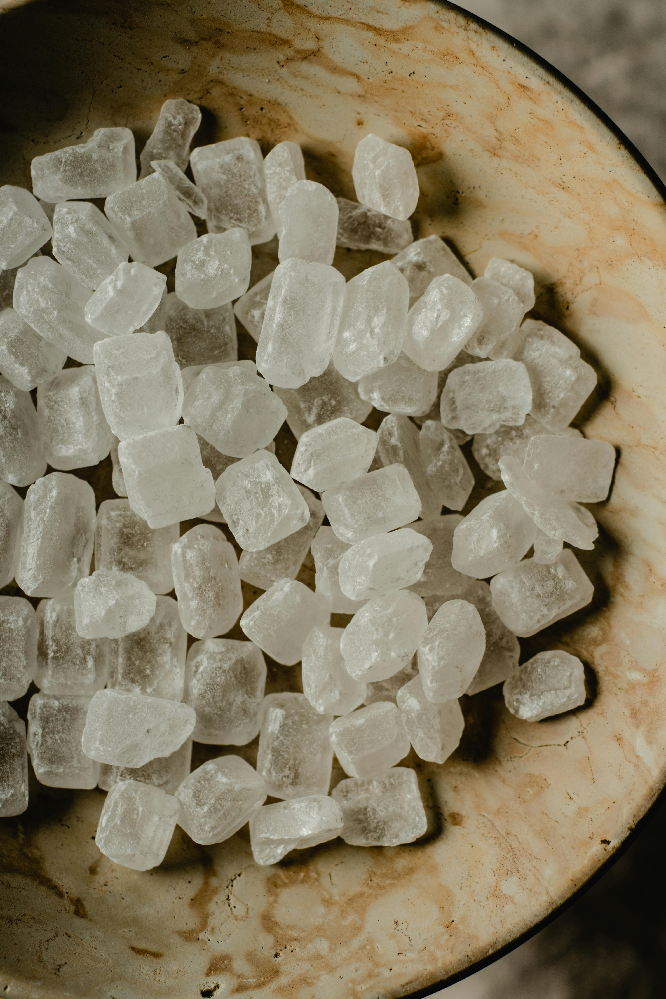
*Figure 6.1-13: Weighing 60g of rock sugar to achieve a professional glossy glaze. (Source: [Eva Bronzini via Pexels](https://www.pexels.com/zh-cn/photo/5988342/))*

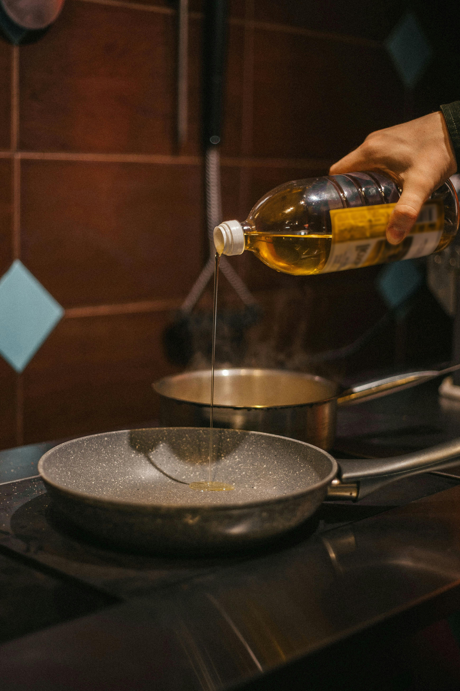
*Figure 6.1-14: Preparing vegetable oil as the essential thermal medium for caramelization. (Source: [Max Avans via Pexels](https://www.pexels.com/zh-cn/photo/5056853/))*

---

### Step 1: Blanching (Cleaning the Meat)
  1. Put the pork cubes into a pot with cold water.
  2. Add 50g of 2 slices of ginger. and 50ml cooking wine.
  3. Bring to a boil, then simmer for 2 minutes to remove impurities.
  4. Drain and rinse the pork with warm water. Pat dry.

### Step 2: Searing (Rendering Fat)
  1. Place the pork in a dry wok over medium heat.
  2. Sear until the sides are golden brown and the natural fat starts to melt (render out).
  * Note: Remove excess oil if the pan becomes too greasy.
  
### Step 3: Caramelizing (The Color Base)
  1. Push the meat to the side. Add a small amount of oil and 60g rock sugar.
  2. Melt the sugar on low heat until it turns a light amber color.
  3. Stir the pork back in to coat every piece with the melted sugar.

### Step 4: Braising (Slow Cooking)
  1. Add the aromatics (50g ginger, 3-4 scallions, 1 star anise, 1 cinnamon).
  2. Add 20ml dark soy sauce (for color) and 60ml light soy sauce (for salt).
  3. Pour in boiling water until the meat is just submerged.
  4. Cover with a lid. Reduce heat to low and simmer for 45–60 minutes.

## 6.2 Quality Control and Finalization (Lead: Yuwen Nie)

**Scope:** This final stage focuses on the "Reduction" phase to achieve the target glaze, followed by a rigorous Quality Assurance (QA) check and troubleshooting protocol to ensure the final "output" meets all safety and aesthetic standards.

### 6.2.1 Final Execution: Reduction and Plating

**Step 5: High-Heat Reduction (The Glazing Phase)**
1. **Tool:** Heat-resistant **silicone spatula** or **tongs**.
2. **Action:** Remove the lid and discard the large aromatics (ginger slices and scallion knots). Increase the heat to **high**.
3. **Observation:** Stir the pork constantly to ensure every cube is evenly coated. 
4. **Why:** This step is **critical because** it triggers the rapid evaporation of excess water, concentrating the sugars and fats to create a professional "mirror glaze" (Viscosity control).

> *Figure 4: The sauce thickening into a glossy amber-red glaze during the reduction phase.*

**Step 6: Plating and Aesthetic Review**
1. **Tool:** Pre-warmed **ceramic serving bowl** and **clean paper towels**.
2. **Action:** Carefully transfer the pork to the bowl. Use a paper towel to wipe any sauce splashes from the rim.
3. **Why:** Maintaining a clean rim is **important because** it ensures "restaurant-grade" presentation and prevents sticky residue from affecting the dining experience.

---

### 6.2.2 Troubleshooting and Disaster Recovery
In the event of a cooking error, use the following matrix to restore the product to standard:

| Symptom (Incident) | Probable Root Cause | Corrective Action (Solution) |
| :--- | :--- | :--- |
| **Meat is tough/rubbery** | Insufficient braising time or heat was too high. | Add 100ml boiling water and simmer on low for an additional 15 mins. |
| **Sauce is thin/watery** | Incomplete reduction phase. | Increase heat to high and stir constantly for 3–5 mins until glaze forms. |
| **Flavor is too salty** | Excess evaporation or measurement error. | Add 2 thick slices of **raw potato**; simmer for 5 mins to absorb salt, then remove. |
| **Color is pale/grey** | Failed caramelization or lack of dark soy sauce. | Add 5ml of dark soy sauce and toss on high heat to "patch" the color. |

---

### 6.3 Plating Inspection Checklist
Before the product is "released" to the table, it must pass this final audit:

- [ ] **Safety Audit:** Internal temperature verified at **≥ 165°F** using a digital probe thermometer.
- [ ] **The "Chopstick Test":** Meat can be pierced with a chopstick with zero resistance (Indicates successful collagen breakdown).
- [ ] **Visual Audit:** Glossy, amber-red finish with no charred or black spots.
- [ ] **Aesthetic Audit:** Plating is clean and free of rim splashes.
   
## 7. Revision History

| Version | Date | Author | Description of Change |
| :--- | :--- | :--- | :--- |
| **0.1** | 2026-03-31 | **Jie Zhuang** | Initial draft and project scope definition. |
| **0.5** | 2026-04-01 | **Dongjun Li** | Defined ingredient standards and pre-treatment steps. |
| **1.0** | 2026-04-01 | **Qianyi Wen** | Integrated core cooking techniques and visual media. |
| **1.5** | 2026-04-01 | **Yuwen Nie** | Added quality control metrics and troubleshooting guide. |
| **2.0** | 2026-04-01 | **Teams** | Finalized SOP framework and formatting. |

